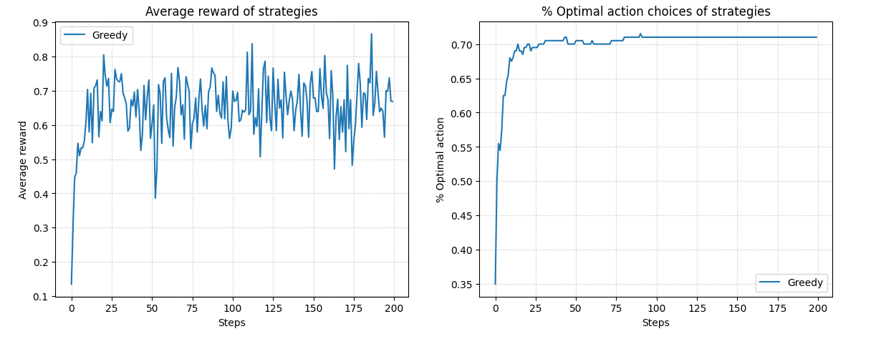
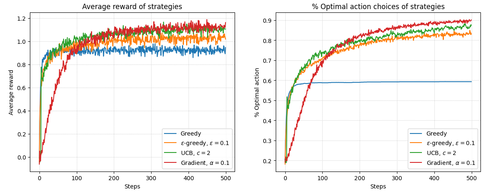

# k-Armed Bandit Problem

The k-armed bandit problem is a classic reinforcement learning task where an agent repeatedly chooses from `k` different options (actions) to maximize the total reward received over a period of time. Each action corresponds to a stationary probability distribution of rewards, and the agent must balance **exploration** (trying new actions to learn more about them) and **exploitation** (choosing the known best action).

## Problem Description

You are faced repeatedly with a choice among `k` actions. Each action provides a numerical reward drawn from a stationary probability distribution. The goal is to maximize the total expected reward over a sequence of steps.

This problem illustrates the trade-off between:
- **Exploration**: Trying less-optimal actions to gather information.
- **Exploitation**: Choosing the current best-known action to maximize reward.

## Algorithms Implemented

### 1. ε-Greedy Action Selection
The ε-greedy algorithm balances exploration and exploitation:
- With probability **1 - ε**, the agent selects the action with the highest estimated value.
- With probability **ε**, the agent selects a random action.

### 2. Gradient Bandit Algorithm
This algorithm learns preferences for actions rather than directly estimating their value. The probability of selecting each action is determined using a **softmax function**.

## Results

#### Single Strategy (Epsilon-Greedy with K=3)
In this simulation, the **Epsilon-Greedy** strategy was tested on a problem with **3 actions (K=3)**. The strategy uses a simple exploration-exploitation trade-off, where it chooses the action with the highest estimated reward most of the time, but occasionally explores other actions with a small probability (`epsilon`).

- **Average Reward** (Left Plot):  
  The average reward stabilizes over time, showing the strategy's ability to learn which actions yield the highest rewards. Early fluctuations reflect the exploration phase, where the strategy experiments with less optimal actions.

- **% Optimal Action Choices** (Right Plot):  
  This plot tracks how often the strategy selects the optimal action. The percentage increases steadily as the agent learns which action is best, eventually stabilizing around 70%, indicating that exploration is limiting its performance slightly.

#### Multiple Strategies (K=5)
This simulation compares the performance of multiple strategies on a problem with **5 actions (K=5)**. The strategies tested include:
- **Greedy**: Always selects the action with the highest estimated value.
- **Epsilon-Greedy (ε=0.1)**: Explores randomly 10% of the time and exploits the best-known action otherwise.
- **Upper Confidence Bound (UCB, c=2)**: Selects actions based on confidence intervals, balancing exploration and exploitation adaptively.
- **Gradient Bandit (α=0.1)**: Uses a preference-based approach, where actions are selected according to their softmax probabilities.

- **Average Reward** (Left Plot):  
  The **Gradient Bandit** and **UCB** strategies outperform others in terms of average reward. The **Greedy** strategy performs the worst due to its lack of exploration, which prevents it from discovering better actions.

- **% Optimal Action Choices** (Right Plot):  
  The Gradient Bandit and UCB strategies quickly converge to selecting the optimal action with high frequency. The Greedy strategy remains at a constant percentage, as it cannot explore sufficiently to improve.

### Key Insights
1. **Exploration Matters**: Strategies like Epsilon-Greedy, UCB, and Gradient Bandit effectively balance exploration and exploitation, leading to better overall performance compared to Greedy.
2. **Gradient Bandit** excels in maximizing rewards when combined with a well-tuned learning rate (`α=0.1`).
3. **UCB** dynamically adjusts exploration based on uncertainty, making it a strong contender in environments with high variability.

These visualizations provide clear evidence of the importance of incorporating exploration into reinforcement learning strategies.

## References

- Sutton, R. S., & Barto, A. G. (2018). *Reinforcement Learning: An Introduction*. (Chapter 2)
- [k-Armed Bandit Problem on Wikipedia](https://en.wikipedia.org/wiki/Multi-armed_bandit)

